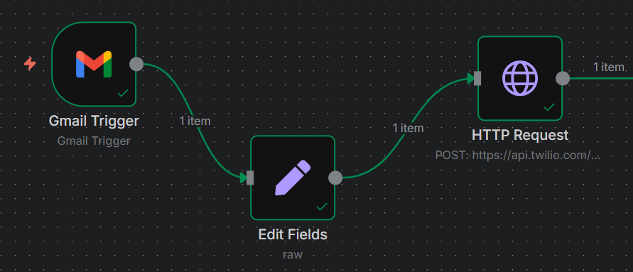

# 📬 n8n Gmail to WhatsApp Alert Automation

🚀 **Stay Ahead with Instant Alerts!**  
This powerful automation workflow, built with [n8n](https://n8n.io/), keeps you in the loop by:  
- 📧 Listening for new Gmail emails via IMAP  
- 🔍 Filtering emails based on subject (e.g., "Security alert")  
- 💬 Sending real-time WhatsApp notifications via Twilio API  

---

## 🛠️ Tech Stack  
- **n8n**: Workflow automation platform (Cloud or Self-hosted)  
- **Gmail IMAP**: Real-time email monitoring  
- **Twilio WhatsApp API**: Instant messaging integration  

---

## ✨ Features  
- ✅ Triggers on new Gmail emails  
- ✅ Filters by subject, sender, or date for targeted alerts  
- ✅ Delivers instant WhatsApp notifications to your phone  

---

## 📂 Project Structure  

```plaintext
n8n-gmail-whatsapp-alert/
├── README.md              # Project documentation
├── workflow.json          # n8n workflow configuration
├── assets/                # Static files
│   └── screenshot.png     # Workflow screenshot
└── .gitignore             # Git ignore file
```

---

## ⚡ Setup Instructions  

### 1. Clone the Repository  
```bash  
git clone https://github.com/YOUR-USERNAME/n8n-gmail-whatsapp-alert.git  
cd n8n-gmail-whatsapp-alert  
```

### 2. Install n8n (if self-hosted)  
```bash  
npm install -g n8n  
n8n  
```

### 3. Import the Workflow  
- Open your n8n instance (Cloud or Self-hosted)  
- Go to **Workflows** > **Import Workflow**  
- Select `workflow.json` from the cloned repository  

### 4. Configure Credentials  

#### Gmail IMAP  
- Enable IMAP in [Gmail Settings](https://mail.google.com/mail/u/0/#settings)  
- If 2FA is enabled, generate an [App Password](https://myaccount.google.com/security)  
- Add your Gmail IMAP credentials in n8n  

#### Twilio WhatsApp API  
- Sign up at [Twilio](https://www.twilio.com/)  
- Obtain your:  
  - Account SID  
  - Auth Token  
  - WhatsApp-enabled Twilio Number  
- Configure these in the n8n Twilio node  

---

## 📷 Preview  
  

**Example WhatsApp Notification**  
```
📧 New Email Alert!  
From: Google  
Subject: Security alert  
Date: 2025-07-26  
```

---

## 📄 License  
[MIT License](https://opensource.org/licenses/MIT)  

---

## 🤝 Let's Connect  
Need help setting this up or want a custom automation for your business?  
Hire me on [Fiverr](https://www.fiverr.com/sellers/nitrola/edit)! 💼  

🌟 **Pro Tip**: Test the workflow with a sample email to ensure notifications work smoothly!
